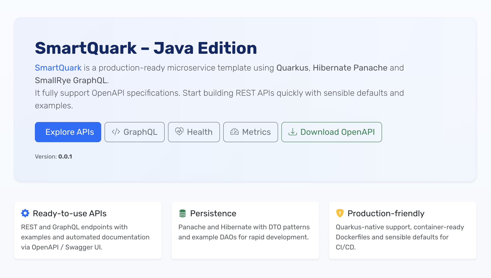

## SmartQuark [Java Edition]

A template project featuring Quarkus written in Java. 
Looking for the Kotlin version? Check out the [Kotlin Edition](https://github.com/guildenstern70/SmartQuark)

### Development mode

    gradle quarkusDev

This project makes use of Quarkus Dev Services that allow you to run a Postgres database in a container.
To run the project and the database, you need to have Docker or Podman installed and running.
There is also a Dev UI, which is available in dev mode only at http://localhost:8080/q/dev/

### Packaging and running the application

The application can be packaged using

    gradle quarkusBuild -Dquarkus.package.type=uber-jar

It produces the `smartquark-[version]-runner.jar` file in the `build` directory. Run with

    java -jar smartquark-[version]-runner.jar

### Creating and running in a Java Container

    gradle quarkusBuild
    docker build -f src/main/docker/Dockerfile.jvm -t guildenstern70/smartquarkus .
    docker run -i --rm -p 8080:8080 -p 5005:5005 -e JAVA_ENABLE_DEBUG="true" guildenstern70/smartquarkus

### Creating a native executable

It is recommended to create an external Postgres database and specify its coordinates as
environment variables, as shown in the 'run-native-example.sh' script.

First, download and install GraalVM CE Java 21.

Install native extensions

    cd /Library/Java/JavaVirtualMachines/graalvm-21.jdk/Contents/Home/bin
    ./gu install native-image

Now, you can create a native executable using: `./build-native`.
You can then execute your native executable with `run-native.sh` script.

### Creating a container

Build Docker image using

    docker build --platform linux/amd64 -f src/main/docker/Dockerfile.jvm -t guildenstern70/smart-quark .

You can test it with

    docker run -i --rm -p 8080:8080 guildenstern70/smart-quark

### Creating a container with a native executable

Unless you are using the same Linux OS of the target deployment machine, if you need to
deploy in Docker, you need also to "build" in Docker. Doing so, Docker requires a lot of resources.

Be sure to have Docker with at least 8 GB and 6 CPUs.

Also, you may adjust the XMX JVM value in

    quarkus.native.native-image-xmx

property (application.yaml). This value should never be < 4g.

Prepare a Linux runnable exec and store in /build/smartquark-[version]-runner running a command
like:

    ./build-docker-native-example.sh

This command prepares also a specific Dockerfile inside

    src/main/docker

To build the Docker image:

    docker build -f src/main/docker/Dockerfile.native -t guildenstern70/smart-quark .

To run it:

    ./run-docker-native

(the above script calls an environment file to pass needed environment variables)

### FAQ

Q: I am getting an error like "Unable to find datasource '<default>' for persistence unit '<default>'".
A: You must have a running Docker or Podman instance, as the project relies on Quarkus Dev Services to run a Postgres database in a container.
Make sure Docker or Podman is installed and running on your machine.

